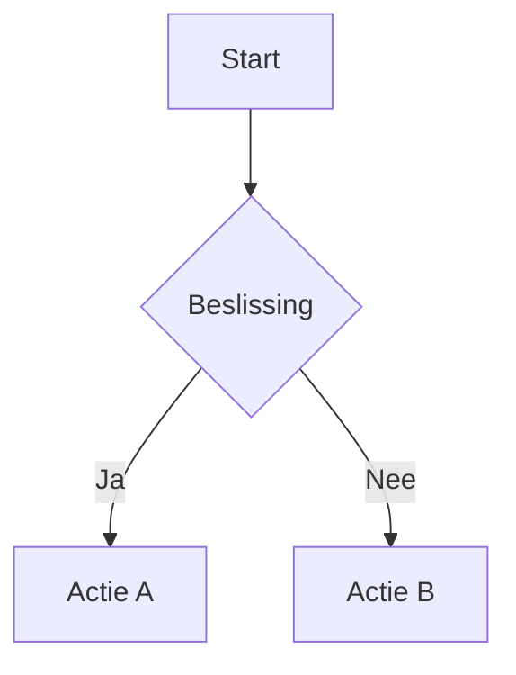

# Machine-Readability Standard — DevHub Systeembestanden

_alsdan-devhub | Versie 1.0 | 2026-03-29_

---

## Doel

Systeembestanden in DevHub bevatten **twee lagen**: menselijke proza (Markdown) en machine-leesbare blokken (YAML/Mermaid). Dit document beschrijft de standaard voor de machine-leesbare laag.

**Governance-basis:** DEV_CONSTITUTION Art. 4.6

---

## Welke bestanden

| Bestandstype | YAML-blokken | Mermaid-diagrammen | Frontmatter |
|-------------|-------------|-------------------|-------------|
| DEV_CONSTITUTION | VERPLICHT per artikel | AANBEVOLEN voor processen | n.v.t. |
| Agent-definities (`agents/*.md`) | n.v.t. | AANBEVOLEN voor flows | VERPLICHT: capabilities, constraints |
| ADRs (`docs/adr/*.md`) | n.v.t. | AANBEVOLEN | VERPLICHT: Status, Datum, Context, Impact-zone tabel |
| Architectuur-overzichten | AANBEVOLEN | VERPLICHT voor componenten/flows | n.v.t. |
| Config bestanden (`config/*.yml`) | n.v.t. (al YAML) | n.v.t. | n.v.t. |

---

## YAML-blokken formaat

### Marker

Elk YAML-blok begint met de marker `# MACHINE-LEESBAAR BLOK` als eerste regel:

```yaml
# MACHINE-LEESBAAR BLOK
artikel: 7
titel: Impact-zonering
regels:
  - id: "7.1"
    tekst: "Dev-lead classificeert elke taak naar zone VÓÓR delegatie"
    type: proces_regel
    enforced_by: [dev-lead, DevOrchestrator]
```

### Plaatsing

Direct na de Markdown-sectie die het beschrijft, vóór de volgende sectie-scheider (`---`).

### Veldtypen voor regels

| Type | Betekenis |
|------|-----------|
| `hard_constraint` | Mag nooit overtreden worden |
| `escalatie_regel` | Bij twijfel: escaleer |
| `proces_regel` | Hoe werk gedaan wordt |
| `definitie` | Definieert een concept of term |

---

## Agent frontmatter formaat

### Verplichte velden

```yaml
---
name: agent-naam
description: >
  Beschrijving van de agent
model: opus | sonnet | haiku
capabilities:
  - capability_1
  - capability_2
constraints:
  - art_N: "beschrijving van constraint"
---
```

### Optionele velden

```yaml
required_packages: [devhub-core]
depends_on_agents: [coder, reviewer]
reads_config: [nodes.yml, documents.yml]
impact_zone_default: GREEN | YELLOW | RED
disallowedTools: Edit, Write, Agent
```

---

## ADR frontmatter formaat

Alle ADRs beginnen met een Markdown-tabel:

```markdown
| Veld | Waarde |
|------|--------|
| Status | Accepted / Proposed / Superseded / Rejected |
| Datum | YYYY-MM-DD |
| Context | Sprint of aanleiding |
| Impact-zone | GREEN / YELLOW / RED (met toelichting) |
```

---

## Mermaid-diagrammen

### Wanneer

- Processen en workflows (flowchart)
- Componenten en afhankelijkheden (graph)
- State machines en levenscycli

### Formaat



---

## Validatie

De reviewer-agent checkt bij review van systeembestanden:

| Check | Beschrijving |
|-------|-------------|
| MR-01 | YAML-blokken aanwezig voor governance/agent-definities |
| MR-02 | YAML parsebaar (yaml.safe_load succeeds) |
| MR-03 | Agent frontmatter bevat capabilities en constraints |
| MR-04 | ADR bevat Status, Datum, Context, Impact-zone tabel |

---

## Versiebeheer

| Versie | Datum | Wijziging |
|--------|-------|-----------|
| 1.0 | 2026-03-29 | Initieel document (Sprint 46: Dual-Format Machine-Leesbare Systeembestanden) |
