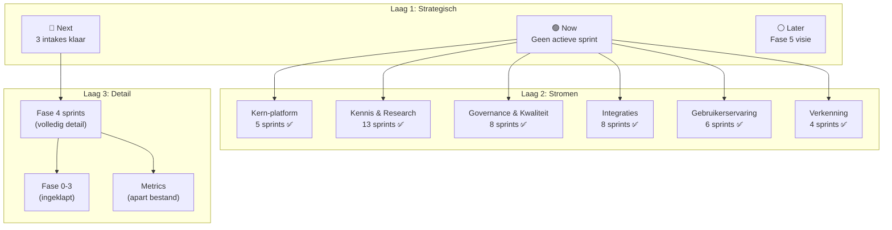

# IDEA: Planning-herstructurering — Drie-lagen overzicht

---
gegenereerd_door: "Cowork — alsdan-devhub"
status: DONE
fase: 4
---

## Kernidee

De SPRINT_TRACKER is uitgegroeid tot 500+ regels chronologische log waar afgerond werk evenveel ruimte krijgt als actief werk. Dit idee herstructureert de planning in drie lagen (Strategisch → Stromen → Detail), gebaseerd op de Now-Next-Later methodiek en Work Stream categorisering. Elke laag beantwoordt een andere vraag: "waar gaan we heen?", "wat loopt er parallel?", "wat zijn de details?". Afgeronde fasen worden ingeklapt tot samenvattingen (zoals ADR-003 al voorschrijft maar nog niet consequent is toegepast).

## Motivatie

Waarom waardevol voor DevHub:

1. **Navigeerbaarheid.** Na 45 sprints en 6 dagen ontwikkeling is de chronologische volgorde geen logische volgorde meer. Sprint 32 (Diátaxis+), Sprint 33 (Research Compas), Sprint 34 (Doc Pipeline) zijn thematisch verwant maar staan als losse intermezzo's tussen andere sprints. Je moet 500 regels scannen om te begrijpen "wat is de staat van documentatie?".

2. **Now-Next-Later ontbreekt.** De SPRINT_TRACKER toont wat GEDAAN is (43+ entries) maar niet wat ACTIEF is (niets, actieve_fase: null), wat KLAAR staat (intakes in inbox), of wat VISIE is (Fase 5). Hierdoor moet je mentaal schakelen tussen SPRINT_TRACKER, inbox-bestanden en ROADMAP.md om het volledige beeld te krijgen.

3. **Intermezzo-probleem.** Sprints 30-38 staan als "intermezzo" omdat ze niet in de Fase 3 golfplanning vielen maar ook niet formeel Fase 4 zijn. Dit is een symptoom van het ontbreken van work streams — thematisch hoort Provider Pattern bij "integraties", Diátaxis+ bij "documentatie", Node-Guardrails bij "governance", maar ze staan allemaal op dezelfde chronologische tijdlijn.

4. **Schaalprobleem.** Bij het huidige groeitempo (45 sprints in 6 dagen) wordt de tracker onhoudbaar lang. Fase 3 alleen al was 22 sprints. Als Fase 4 vergelijkbaar is, wordt de tracker 800+ regels.

5. **Afstemming Cowork ↔ Claude Code.** Cowork (planningsniveau) en Claude Code (uitvoeringsniveau) kijken naar dezelfde SPRINT_TRACKER maar met andere vragen. Cowork wil weten "wat is het volgende logische voorstel?", Claude Code wil weten "welke sprint moet ik uitvoeren?". Drie lagen bedienen beide perspectieven.

## Impact

```yaml
impact:
  op: [planning-systeem, sprint-skill, sprint-prep-skill, planner-agent, dashboard]
  grootte: Middel
  raakt_packages: []  # planning is docs-only, geen package-wijzigingen
  raakt_agents: [planner, dev-lead]
  raakt_skills: [devhub-sprint, devhub-sprint-prep]
  raakt_documenten: [SPRINT_TRACKER.md, ROADMAP.md]
```

## Diagnose: waarom het een oerwoud is (geverifieerd 2026-03-29)

```yaml
diagnose:
  symptoom_1:
    naam: "Alles op één vlak"
    detail: |
      Sprint 1 (FASE1_BOOTSTRAP, 2026-03-23) krijgt evenveel visuele ruimte als
      Sprint 45 (Dashboard Research Upgrade, 2026-03-29). Er is geen visuele
      hiërarchie tussen verleden, heden en toekomst.
    meting: "45 sprint-entries, waarvan 45 afgerond, 0 actief"

  symptoom_2:
    naam: "Chronologie ≠ logica"
    detail: |
      Sprints zijn genummerd 1-45 in volgorde van uitvoering, maar de logische
      samenhang is thematisch: documentatie-sprints (32, 34), Research Compas (33, 35),
      Node-Guardrails (36, 37), Dashboard (43, 44, 45) horen bij elkaar maar staan
      verspreid over de tijdlijn.
    voorbeeld: "Documentatie: Sprint 32 → Sprint 34 (tussenin: Sprint 33 Research Compas)"

  symptoom_3:
    naam: "Intermezzo als noodoplossing"
    detail: |
      12 van de 15 post-Fase-3 sprints staan als "Intermezzo" omdat het planning-model
      alleen fasen kent, geen stromen. Het intermezzo-label verbergt dat er wel degelijk
      een structuur is — het is alleen niet geëxpliciteerd.
    meting: "12 intermezzo-sprints vs. 3 formele Fase 4 sprints"

  symptoom_4:
    naam: "Velocity/Cycle tables domineren"
    detail: |
      De velocity-tabel (45 rijen) en cycle-time tabel (45 rijen) zijn waardevol
      als data maar nemen ~120 regels in die zelden geraadpleegd worden bij dagelijkse
      planning. Ze zouden als referentie-appendix of apart bestand beter passen.
    meting: "~120 regels metrics vs. ~200 regels sprint-beschrijvingen"

  symptoom_5:
    naam: "Toekomst is onzichtbaar"
    detail: |
      De tracker toont alleen het verleden. Er is geen sectie voor "wat staat klaar
      in de inbox", "wat is de volgende logische stap", of "wat is de Fase 4/5 visie".
      Dit staat verspreid over inbox-bestanden, ROADMAP.md, en Cowork-gesprekken.
```

## Voorgestelde oplossing: Drie-lagen planning

### SOTA-onderbouwing

```yaml
sota_bronnen:
  now_next_later:
    bron: "Janna Bastow (ProdPad), 2019"
    kernprincipe: "Vervang datums door tijdhorizonten; alleen 'Now' is gecommit"
    toepassing: "Strategische laag — Now/Next/Later als hoofd-indeling"
    gradering: SILVER  # breed geadopteerd, niet academisch

  work_streams:
    bron: "AWS Prescriptive Guidance + SAFe Workstream Architecture"
    kernprincipe: "Parallelle horizontale stromen per werktype, elk met eigen ritme"
    toepassing: "Stromen-laag — thematische categorisering i.p.v. chronologie"
    gradering: SILVER  # industriestandaard

  shape_up_hill_charts:
    bron: "Shape Up (Basecamp, 2019)"
    kernprincipe: "Track 'onbekenden oplossen' niet alleen 'taken afvinken'"
    toepassing: "Detail-laag — hill charts per actieve scope"
    gradering: SILVER  # al in gebruik in DevHub

  para_method:
    bron: "Tiago Forte — Building a Second Brain, 2022"
    kernprincipe: "Organiseer op actie-niveau, niet op onderwerp"
    toepassing: "Archivering — afgeronde fasen naar referentie, niet in actief overzicht"
    gradering: BRONZE  # persoonlijke productiviteit, niet specifiek software

  value_stream_mapping:
    bron: "DORA (Google), Lean/Kanban"
    kernprincipe: "Visualiseer end-to-end flow, identificeer wachttijden en bottlenecks"
    toepassing: "Metrics-appendix — lead time, cycle time als apart referentiedocument"
    gradering: GOLD  # decennia bewezen
```

### Laag 1: Strategisch (Now-Next-Later)

```yaml
laag_1_strategisch:
  doel: "Eén scherm dat toont: wat is actief, wat is gepland, wat is visie"
  formaat: "Bovenaan SPRINT_TRACKER, max 30-40 regels"
  inhoud:
    now:
      beschrijving: "Actieve sprint(s) + wat Claude Code nu doet"
      voorbeeld: |
        ### 🟢 Now
        Geen actieve sprint. Laatste: Sprint 45 (Dashboard Research Upgrade) ✅

    next:
      beschrijving: "Geshaped + goedgekeurd, klaar voor Claude Code"
      voorbeeld: |
        ### 🔵 Next
        | Intake | Stroom | Type | Prioriteit |
        |--------|--------|------|------------|
        | Dual-Format Machine-Leesbare Systeembestanden | Governance | FEAT | Hoog |
        | Kennisketen End-to-End | Kennis | FEAT | Hoog |
        | Dashboard NiceGUI → FastAPI+HTMX Migratie | Platform | FEAT | Middel |

    later:
      beschrijving: "Visie-items, ideeën, Fase 5 richting"
      voorbeeld: |
        ### ⚪ Later
        - n8n Event Scheduler (SPIKE afgerond, wacht op Docker setup)
        - Mentor Supervisor Systeem (Track M S3)
        - Fase 5: Agent Teams, plugin marketplace, 2e project PoC
```

### Laag 2: Work Streams (thematische categorisering)

```yaml
laag_2_stromen:
  doel: "Alle sprints thematisch gecategoriseerd — niet chronologisch maar logisch"
  formaat: "Midden-sectie SPRINT_TRACKER, vervangt chronologische intermezzo's"

  voorgestelde_stromen:
    kern_platform:
      beschrijving: "Packages, contracts, event bus, runtime-infra"
      sprints: [1, 2, 5, 30, 42]
      voorbeeld_items:
        - "FASE1_BOOTSTRAP"
        - "UV_WORKSPACE_TRANSITIE"
        - "Provider Pattern"
        - "Event Bus Lifecycle Hooks"

    kennis_en_research:
      beschrijving: "Kennispipeline, vectorstore, Research Compas, documentatie"
      sprints: [10, 15, 18, 19, 20, 21, 22, 29, 31, 32, 33, 34, 35]
      voorbeeld_items:
        - "Vectorstore Interface + ChromaDB"
        - "KP Golf 1-3"
        - "Diátaxis+ Taxonomie"
        - "Research Compas Config + Runtime"
        - "Doc Pipeline"

    governance_en_kwaliteit:
      beschrijving: "DEV_CONSTITUTION, security, tests, guardrails, health"
      sprints: [4, 13, 17, 25, 26, 27, 36, 37]
      voorbeeld_items:
        - "CODE_CHECK_ARCHITECTUUR"
        - "Governance QA Checks"
        - "SecurityScanner"
        - "Lifecycle Hygiene"
        - "Node-Guardrails"

    integraties:
      beschrijving: "Google Drive, n8n, BorisAdapter, externe systemen"
      sprints: [3, 9, 14, 24, 28, 38, 40, 41]
      voorbeeld_items:
        - "N8N_CICD_FOUNDATION"
        - "Storage Interface + adapters"
        - "DriveSyncAdapter"
        - "n8n Event Scheduler SPIKE"

    gebruikerservaring:
      beschrijving: "Dashboard, mentor-systeem, skills, agent UX"
      sprints: [12, 16, 23, 43, 44, 45]
      voorbeeld_items:
        - "Mentor: Skill Radar + Challenge Engine + Research Advisor"
        - "DevHub Dashboard NiceGUI"
        - "Dashboard upgrades"

    verkenning:
      beschrijving: "SPIKEs, research-sprints, proof-of-concepts"
      sprints: [6, 31, 39, 40]
      voorbeeld_items:
        - "Ops Validatie SPIKE"
        - "Claude Optimalisatie Research"
        - "Agent Teams SPIKE"
```

### Laag 3: Detail (alleen actieve fase)

```yaml
laag_3_detail:
  doel: "Volledig sprintdetail — alleen voor de actieve fase"
  formaat: "Huidige SPRINT_TRACKER stijl, maar alleen Fase 4"

  afgeronde_fasen:
    behandeling: "Ingeklapt tot 5-regel samenvatting per fase"
    voorbeeld: |
      ## Fase 0-3 (Afgerond)
      | Fase | Sprints | Tests Δ | Duur | Samenvatting |
      |------|---------|---------|------|--------------|
      | 0 | 2 | 0→397 | <1 dag | Fundament + planning |
      | 1 | 2 | 218→339 | 1 dag | Kernagents + infra |
      | 2 | 4 | 339→395 | 2 dagen | Skills + governance + red-team |
      | 3 | 22 | 395→1191 | 3 dagen | Knowledge, storage, vectorstore, mentor, governance |
      _Detail: zie `docs/planning/archive/`_

  actieve_fase:
    behandeling: "Volledige sprint-tabellen, hill charts, afhankelijkheden"

  metrics:
    behandeling: "Verplaats velocity + cycle time naar apart referentie-bestand"
    nieuw_bestand: "docs/planning/VELOCITY_LOG.md of docs/planning/metrics/"
    reden: "120 regels metrics die zelden dagelijks geraadpleegd worden"
```

### Visueel voorbeeld (Mermaid)



## Relatie met bestaande structuur

```yaml
relatie:
  sprint_tracker:
    wijziging: "Herstructurering van inhoud, niet van bestand"
    backwards_compatible: "Alle data blijft behouden, wordt herschikt"
    adr_003_conformiteit: "Versterkt ADR-003 — inklap-principe wordt eindelijk consequent toegepast"

  roadmap:
    wijziging: "ROADMAP.md kan vereenvoudigd — strategisch overzicht zit nu in tracker Laag 1"
    optie: "ROADMAP.md wordt puur visie-document (Fase 5+), niet meer overlap met tracker"

  inbox:
    wijziging: "Geen — inbox blijft de schrijflocatie voor Cowork"
    verbetering: "Laag 1 'Next' sectie verwijst expliciet naar inbox-bestanden"

  dashboard:
    wijziging: "Dashboard kan stromen-indeling overnemen voor planning-paneel"
    versterkt: "SprintTrackerParser kan stromen parsen i.p.v. alleen chronologie"

  raakt_agents: [planner, dev-lead]
  raakt_skills: [devhub-sprint, devhub-sprint-prep, devhub-health]
  raakt_governance: [ADR-003 versterking]
  afhankelijk_van: geen
```

## BORIS-impact

```yaml
boris_impact:
  direct: nee
  indirect: ja
  toelichting: |
    BORIS-sprints (die via node: boris-buurts in intakes staan) worden automatisch
    onderdeel van de stromen-indeling. Wanneer BORIS-werk start, krijgt het een
    eigen stroom of wordt het onderdeel van "Integraties". Geen wijzigingen aan
    BORIS-repo nodig.
```

## Open punten

1. **Stromen-indeling definitief?** De 6 voorgestelde stromen (Kern-platform, Kennis & Research, Governance & Kwaliteit, Integraties, Gebruikerservaring, Verkenning) zijn gebaseerd op de huidige 45 sprints. Zijn dit de juiste categorieën of missen er stromen / zijn er te veel?

2. **Metrics: apart bestand of appendix?** Velocity en cycle time tabellen (120+ regels) zouden naar een apart `VELOCITY_LOG.md` kunnen. Alternatief: als inklapbare appendix onderaan de tracker houden. Wat heeft voorkeur?

3. **Sprints met meerdere stromen.** Sommige sprints raken meerdere stromen (bijv. Sprint 11 "Planning & Tracking" raakt zowel governance als platform). Primaire stroom kiezen, of dubbel vermelden?

4. **Fase-overgang-ritueel.** Bij Fase 4→5 overgang: automatisch de detail-laag archiveren? Of handmatig door Claude Code bij sprint-afsluiting?

5. **Dashboard-integratie.** De SprintTrackerParser in het dashboard parst nu de chronologische structuur. Na herstructurering moet deze parser aangepast worden. Timing: voor of na de planning-herstructurering?
